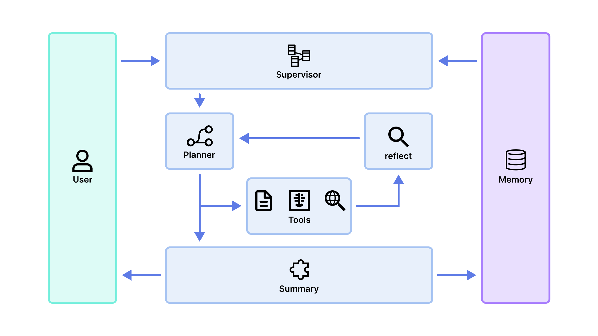

<p align="center">
  
</p>

<h1 align="center">Medora：医疗解析与疾病管理智能体</h1>

<p align="center">
    
    
    

<p align="center">
    <a href="README.md">English</a> | <a href="README.zh.md">中文</a>
</p>

https://github.com/user-attachments/assets/7c7dc6c9-baf6-4bb8-a335-5f1f880797fa

## 📊 背景

近年来，慢性病已成为全球公共卫生的主要负担，非传染性慢性疾病约占全球死亡人数的 74%。慢性病患者通常需要长期随访管理，包括反复检查、持续用药以及跨时间段的健康监测，因而往往积累大量分散的医疗记录，需要进行持续的对比分析。然而，针对慢性病患者的健康素养研究表明，仅约 21.6% 的患者具备充分的健康素养，而这与药物理解准确性显著相关，直接影响患者对医疗资料的理解、依从性和执行效果。在市场规模方面，全球慢性病管理市场预计将从约 60 亿美元增长至逾 170 亿美元，同样显示出慢性病管理领域需求的持续扩大。

## 🏗️ 系统架构

<p align="center">
  
</p>

## ✨ 核心亮点

- **医学意图路由 + 多轮智能体编排**：`Supervisor` 先用 LLM + 规则识别“医学 / 非医学”意图，非医学问题直接由 LLM 友好回复；医学问题则进入 `Planner → Tooler → Searcher → Reflector → Summarize` 的多阶段流水线，避免“所有问题一股脑走重流程”。
- **文本 + PDF + 影像的多模态解析**：支持纯文本病历、PDF 报告以及影像截图三类输入；PDF 通过 `parse_pdf` 提取文字与内嵌图片，影像再经 MedGemma 风格的多模态模型（`medgemma_analyze_image`）结合临床上下文统一分析。
- **检索增强医学知识补充**：`web_search` 基于 Tavily 医学检索，`rag_search` 通过 Chroma 本地知识库查询；在 `Tooler` / `Searcher` 中分别做“在线 + 本地”双通道检索，再由 LLM 汇总为可读的医学背景说明。
- **规划—反思闭环的疾病管理计划**：`Planner` 先根据原始文本生成初始 TODO 方案，再结合解析结果与检索信息更新计划；`Reflector` 对“解析 + 检索 + 计划”整体做一致性与安全性反思，最终由 `Summarizer` 产出面向患者的口语化总结与长期管理建议。

## ⚙️ 功能

用户在就诊后上传病历文本、检查报告或影像说明，系统利用 MedGemma 模型进行医学语义解析，提取诊断、用药、关键指标等核心信息并生成结构化摘要，为患者提供可读性高的解析文本。同时结合 Web Search 补充医学术语说明与相关背景知识，在不进行诊断替代的前提下增强理解。解析结果将被持续存储，用于后续对比病情变化与长期健康管理，并根据用药信息生成提醒和随访提示，从而支持患者在治疗与康复阶段的持续执行与自我管理。

## 🧭 核心功能实现思路

1) 智能体编排与状态流
- 图编排：基于 LangGraph，构建 `supervisor → planner → {tooler, searcher, reflector} → summarize` 的有向图；`tooler/searcher/reflector` 完成一次后会回到 `planner`，由规划节点决定是否继续迭代还是进入总结阶段。
- 状态建模：`MedAgentState`记录整个对话过程中的 `raw_text / images / merged_analysis / search_results / plan / reflection / summary` 等字段，所有节点都在同一状态上增量更新。
- 入口路由：`Supervisor` 结合 `_classify_query_intent` 的 LLM 结果和关键字规则判断是否为医学相关；若为非医学问候，则直接生成一条自然回复并终结图；若为医学问题，则初始化 `plan` 与工具状态后跳转到 `Planner`。

2) 解析与检索工具层
- 文本 & 影像解析：`Tooler` 调用 `medgemma_analyze_text` 和 `medgemma_analyze_image`，前者用大模型结构化抽取诊断、检查与用药要点，后者对影像进行医学解读；当既有文本又有影像时，再通过 `MERGE_PROMPT` 由 LLM 将两路结果合并为统一医学分析。
- PDF 处理：若用户上传 PDF，`run_multi_agent` 会先使用 `parse_pdf`抽取全文文本与所有页内嵌图片，将文本拼接入 `raw_text`，图片转为 base64 进入图像分析分支，实现“一次上传 = 文本 + 影像全量解析”。
- 检索增强：`web_search` 封装 Tavily API，面向“医学 xxx”查询返回精简网页片段；`rag_search` 连接 Chroma 本地 collection `medical_knowledge`，按主题抽取 topK 段落。`Tooler` 和 `Searcher` 节点会把两路结果拼接，再交给 LLM 用 `SEARCH_SUMMARY_PROMPT` 做二次总结，输出给后续规划与反思使用。

3) 规划、反思与总结
- 规划器（Planner）：在首次进入时基于 `raw_text` 调用 `PLAN_INIT_PROMPT` 生成一版基础 TODO 样式的长期管理计划；在拿到 `merged_analysis + search_results` 后，用 `PLAN_PROMPT` 生成“解析 + 检索驱动”的升级版方案，并在 state 中标记 `plan_updated`。
- 反思器（Reflector）：`Reflector` 根据 `REFLECT_PROMPT` 对当前解析、检索与计划进行一致性、安全性和可执行性审查；若模型不可用，则返回“质检暂不可用”一类的软降级提示，主流程不被阻塞。
- 总结器（Summarizer）：对医学问题使用 `SUMMARIZE_PROMPT`，将“解析 + 检索 + 计划 + 反思”融合为患者可读的中文说明和执行要点；对非医学小聊，则用 `NON_MEDICAL_REPLY_PROMPT` 提供简单陪伴式回答。

4) 运行时与数据落盘
- 运行进度管理：`runtime/progress.py` 对每次调用生成默认六阶段的时间线，并在 `begin_run / mark_stage / complete_run / fail_run` 时通过内存结构与 SSE 广播更新，前端直接订阅 `/api/multi-agent/events/{run_id}` 即可获得“阶段状态 + 内容快照”。
- 患者与随访数据：`utils/db.py` 使用 `aiosqlite` 初始化 `patients / medical_records / follow_up_plans` 三张表，分别存储患者基本信息、结构化病历记录及随访计划内容，为后续扩展“长期随访页面 / 患者故事时间线”等功能预留基础数据层。

## 🚀 快速开始

### 环境要求

- Python ≥ 3.11
- Node.js ≥ 18
- 推荐有 CUDA GPU（用于 PDF OCR / 版面分析）

### 1. 克隆项目 & 配置环境变量

```bash
git clone https://github.com/wuli666/medgemma_afu.git
cd medgemma_afu
cp .env.example .env
# 编辑 .env，填入你的 API Key（DASHSCOPE_API_KEY、TAVILY_API_KEY 等）
```

### 2. 安装后端依赖

```bash
python -m venv .venv
source .venv/bin/activate
pip install -r requirements.txt
```

### 3. 配置 MinerU（PDF 解析 / OCR / 版面分析）

```bash
# 下载 OCR / 版面分析模型（约几 GB）
mineru-models-download

# 编辑 ~/magic-pdf.json，确认 "models-dir" 指向实际模型目录，
# 例如 "/home/<用户名>/.cache/magic-pdf/models/models"

# 如果不需要公式识别，将 formula-config.enable 设为 false，
# 可以避免 transformers 版本冲突。
```

### 4. 安装前端依赖

```bash
cd frontend
npm install
cd ..
```

### 5. 启动

**方式 A — 使用启动脚本：**

```bash
bash start_all.sh
```

**方式 B — 手动分别启动：**

```bash
# 终端 1：后端
source .venv/bin/activate
python -m uvicorn api.main:app --host 0.0.0.0 --port 8000

# 终端 2：前端
cd frontend
npm run dev -- --host 0.0.0.0 --port 5173
```

浏览器打开 http://localhost:5173 即可使用。

### 注意事项

- MinerU 配置文件在 `~/magic-pdf.json`，关键字段：`models-dir`（模型路径）、`device-mode`（`cuda` / `cpu`）、`formula-config.enable`（如 transformers 版本冲突可设为 `false`）。
- 如果你使用 conda 环境（如 `rag`）且已有 PyTorch，启动后端时请用该环境的 Python，而非 `.venv`。

## 📁 项目结构

```
medgemma_afu/
├── api/                   # 后端API服务
│   ├── main.py            # FastAPI主入口
│   └── schemas.py         # 数据模型定义
├── src/                   # 核心业务逻辑
│   ├── agents/            # 智能体实现
│   ├── graph/             # 工作流编排
│   │   ├── builder.py     # 图构建器
│   │   ├── nodes.py       # 节点定义
│   │   └── state.py       # 状态管理
│   ├── llm/               # LLM集成
│   ├── prompts/           # 提示词模板
│   ├── runtime/           # 运行时工具
│   ├── tool/              # 工具集合
│   └── utils/             # 工具函数
├── frontend/              # 前端应用
│   ├── src/
│   │   ├── components/    # UI组件
│   │   ├── pages/         # 页面组件
│   │   └── lib/           # 工具库
│   └── package.json       # 前端依赖
├── data/                  # 数据存储
│   ├── chroma/            # 向量数据库
│   └── patients.db        # 患者数据库
└── requirements.txt       # Python依赖
```
